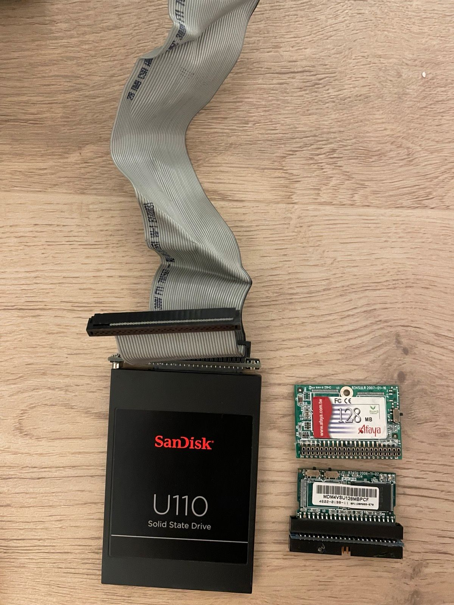

# Thecus-N7700-Pro-Mod
I decided to sell this machine but I thought maybe other people could use the information I gathered (mostly somewhere on the thecus websites after digging though)
I put documentation pdf files, [software](docs/ThecusNASSoftware.zip) and a copy of the [original OS](Thecus_NAS_OS5_X32_FW_beta_5.03.02.8.rom) (Caution! never tested this, found it somewhere) to the [docs folder](docs).
Moreover I share my modifications to make this old NAS a usable fileserver or backup target in 2024

  

# Specs
* [Website Thecus N770 Pro specs](https://www.thecus.com/product?cat=linux_nas&cat_type=smbTower&PROD_ID=27&language_num=1)
  * [Print2PDF of Website](doks/specs.pdf)  
* [User Manual](docs/N7700PRO_UM_V1.1_EN.pdf)
## Infos about the NICs
The NAS has two Intel 82574L 10/100/1000 Mbit/s NICs
```bash
root@nas:~# lspci | egrep -i --color 'network|ethernet'
01:00.0 Ethernet controller: Intel Corporation 82574L Gigabit Network Connection
02:00.0 Ethernet controller: Intel Corporation 82574L Gigabit Network Connection
```

# Modifications
My modifications are inspired by this [blog article](https://www.mogilowski.net/2016/07/22/fixing-broken-thecus-n8800pro-nas-or-install-linux-on-thecus-n8880pro-nas/)
## Make the VGA port usable
There is a VGA port on the mainboard, but no connector is soldered here. In the case there is even a fitting cutout for the VGA connector.
1. Disassemble the NAS, get the mainboard out (see [Maintance manual](docs/N7700-motherboard-and-power-supply-replacing-SOP2008-11-11.pdf)


3. There are soldering connections for a VGA Port.
   1. Get a VGA Port e.g. from a broken mainboard.
   2. Solder the VGA port to the board.
3. Punch out the cut-out for the VGA port on the backside of the case


   
5. Assemble and test.
   
   

6. Start and **Hold** Del-Key for BIOS.
   
   

## Boot drive
At this point you could sacrifice one of the 7 3.5" Bays for a boot drive <br>
**OR much better** you get an adapter to connect a SATA SSD to the IDE port of the DOM
be careful, my first order was an Adapter with the wrong direction
1. Search for SATA 22pin to 44pin IDE (**not!** 44pin IDE to SATA)
   * [This Adapter](https://www.ebay.de/itm/333395176710) worked for me
2. You need a 44pin IDE cable, around 30cm long




4.  You can clamp the SSD in the top of the case. No mount needed
   


## Display
After installing some 'aftermarket' OS the display and the buttons on the front of the case do not work.
There is some microcontroller on the mainboard to control buttons and display, the software part is missing here
It seems like a regular 2x20 display, so I guess one could
- Hack the original hardware and build software to control the display from the new OS directly
- Connect an Arduino to display and buttons and to the NAS via USB (if I remember correctly there is one internal USB header)
and then use the display to show some information like IP, temps or whatever


